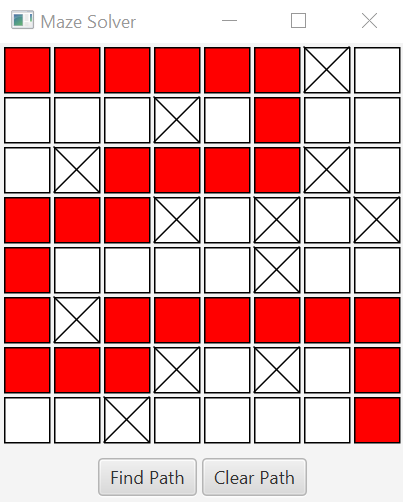

# Project 1: Maze Solver

## About the Project
This project is a Java application that solves mazes. It uses a recursive algorithm to find a path from the start to the end of the maze.

## Features
- Interactive GUI
- Ability to manually block/unblock cells
- Pathfinding visualization

## Screenshots

