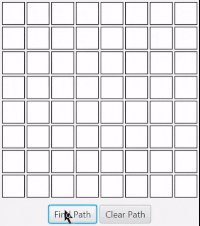

# Project 1: Maze Solver

## About the Project
This project is a Java application that solves mazes, based on Liang's Intro to Java 12th ed, chapter 18, exercise 26. It uses a recursive algorithm to find a path from the start to the end of the maze.

## Features
- Interactive GUI
- Ability to manually block/unblock cells
- Pathfinding visualization

## Challenges
The big challenge was implementing the recursive pathfinding algorithm. ChatGPT helped me develop the backtracking part of the recursion, but other that pretty much most of the code was written by me. 

## Notes about efficiency
The algorithm isn't very efficient. I haven't learned A* or anything like that yet. The only efficiency it has is that it won't make squares (4 cells, 2 on top of each other).
