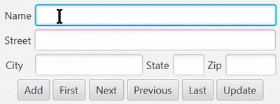

# Project 2: Address Book

## About the Project
This a simple address book that saves to a file, based on Liang's Intro to Java 12th ed, chapter 17, exercise 9. It uses RandomAccessFile to navigate and modify the file at the byte level.

## Features
- JavaFX Interface: Easy-to-use interface for managing address entries.
- CRUD Functionality: Add, view, update, and delete address records.
- Random Access File: Efficient data handling with direct file manipulation.
- Navigation Controls: Browse through records using First, Next, Previous, Last buttons.
- Error Handling: Robust mechanisms to manage file access and input errors.

## Challenges
Not a very challenging project, aside from learning how to use the interface to make my code less ugly.
