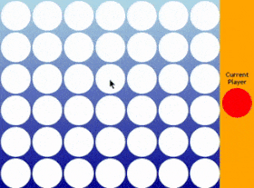

# Project 3: Connect Four

## About the Project
A connect four game that allows users to click on the desired location and drop a colored disc.

## Features
-Interactive Gameplay: Users can click to drop colored discs, simulating the classic Connect Four experience.
-Disc Drop Animation: Features animations for the discs' dropping and bouncing effects.
-Dynamic Player Indicator: Displays the current player's turn with a visual indicator.

## Challenges
-Using multiple sounds didn't end up working out. I needed help from chatgpt for the multiple transitions to show the disc bounce.
