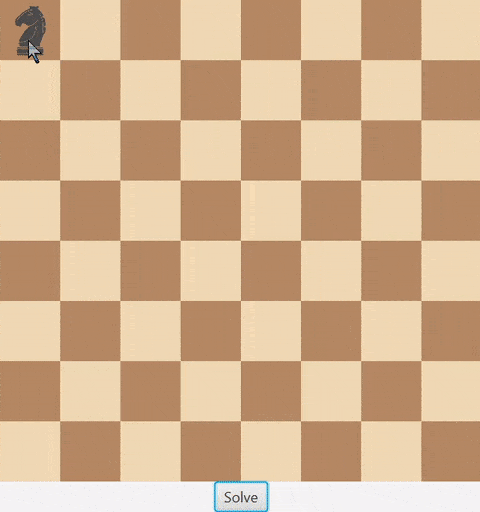

# Project 4: Knight's Tour

## About the Project
A program that uses a GUI and recursion to solve the knight's tour problem (finding a way to move the knight to every square
on the board without going to any square twice)

## Features
- Drag-and-Drop Knight Placement: Users can drag the knight to their chosen starting square.
- Animated Path Tracing: The knight's tour is animated, tracing each move on the board.
- Color-Changing Path: The path changes colors progressively to indicate the order of moves.
- Optimized: The logic uses a heuristic to optimize the time it takes to find a solution.

## Challenges
- I'm still learning about recursion and had to get help from chatgpt for a bit of the recursive logic. I knew nothing about
- DropShadow or how to drag and drop and my book hasn't covered that yet, so chatgpt helped there too. I would say that aside
- from that, the biggest challenge was adjusting to a bit longer of a program (~300 lines) than I'm used to making. Initially I
- just made the logic work and then came back later and did the GUI step by step.
